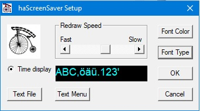
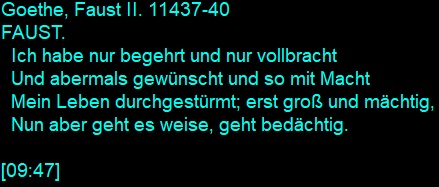
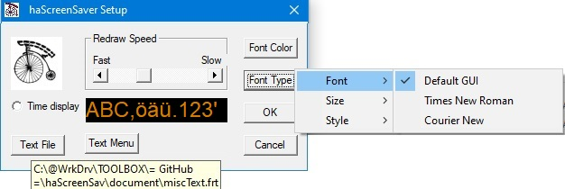
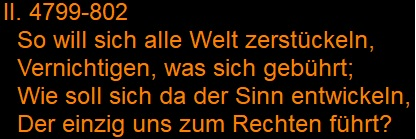

# haScreenSav

#### Screensaver - Johann Wolfgang Goethe: Faust I+II Breviary

Customize your screen and copy `haScreenSav.SCR` into the `c:\windows\system32` folder.    
Select it as the current screensaver, and, in settings choose your personal flavour.    
*haScreenSav* will randomly extract excerpts from the famous FAUST tragedy  
written by the genius Johann Wolfgang Goethe (original in German).

Note: 
The Faust Breviary is the intrinsic default (no additional file required).  
All files `*.frt` must be located *outside* the `c:\windows\system32` folder.  
(As an Example of the *FRT-File Format*, the file `document/haFaust.frt` is provided.)  

Last Update September 11, 2025: *haScreensav.scr, haScreensav.exe*   
Additions:  
 `document/LichtenbergAphorismen.frt`  
 `document/SchopenhauerAphorismen.frt`  
 `document/LudwigHohl.frt`
 `document/Maximen&Reflexionen.frt`
 `document/Maxims&Reflections.frt`
 `document/Bibel (TORa'H).frt`  
 `document/Stimmerheber.frt`  
 `document/Vergleichende.frt`  
  
Changes:    
`source/haScreensav.cpp` Prolonging reading time by pressing `<SPACE>`      
Additions:    
`source/haScrMenu.cpp`   A menu allows to examine the text step by step           
`source/haScreensav.exe` Run the cunfiguration and menu directly            

Examples:  
  

  

  

  

[Lichtenberg](document/image/haScrSav05.jpg)  

[Vergleichende](document/image/haScrSav06.jpg)  

[Im Anfang 1M6.3-4](document/image/haScrSav07.jpg)  

[Schopenhauer](document/image/haScrSav08.jpg)  

[Ludwig Hohl](document/image/haScrSav09.jpg)  

[Goethe - Maximen&Reflexionen](document/image/haScrSav10.jpg)  

[Miscellaneous](document/image/haScrSav11.jpg)  

[TagLines](document/image/haScrSav12.jpg)  

[Goethe - Maxims&Reflexions](document/image/haScrSav13.jpg)  
